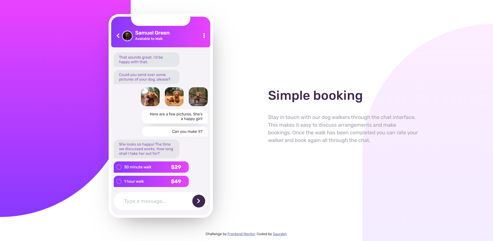

# Frontend Mentor - Chat app CSS illustration solution

This is a solution to the [Chat app CSS illustration challenge on Frontend Mentor](https://www.frontendmentor.io/challenges/chat-app-css-illustration-O5auMkFqY). Frontend Mentor challenges help you improve your coding skills by building realistic projects.

## Table of contents

- [Overview](#overview)
  - [The challenge](#the-challenge)
  - [Screenshot](#screenshot)
  - [Links](#links)
- [My process](#my-process)
  - [Built with](#built-with)
  - [What I learned](#what-i-learned)
  - [Continued development](#continued-development)
  - [Useful resources](#useful-resources)
- [Author](#author)
- [Acknowledgments](#acknowledgments)

## Overview

### The challenge

Users should be able to:

- View the optimal layout for the component depending on their device's screen size
- **Bonus**: See the chat interface animate on the initial load

### Screenshot



### Links

- Solution URL: [Solution URL](https://github.com/saurabh1996-rex/Chat-app-illustration/)
- Live Site URL: [live site URL](https://saurabh1996-rex.github.io/Chat-app-illustration/)

## My process

### Built with

- Semantic HTML5 markup
- Mobile-first workflow
- Flexbox
- CSS custom properties
- SASS

### What I learned

I was able to make use of the pseudo-elements gracefully and create awesome background effects. It was also nice working with CSS inorder to make it even cooler. Mobile First approach is really stealing the show for me. I'd recommend it to everyone who's new in here. I was also able to know much in detail about flexbox properties.

To see how you can add code snippets, see below:

```css
.flextry {
  display: flex;
  align-items: center;
  justify-content: space-between;
  width: 100%;
}
```

### Continued development

Really looking forward in working with much more complex CSS styles. I will be working on understanding flexbox and grid concepts in detail so that it'd be easier for me as I move along.


### Useful resources

- [W3 Schools](https://www.w3schools.com/) - This has been my first line of contact when I was stuck at stages. It usually solved all my quests.


## Author

- Frontend Mentor - [@saurabh1996-rex](https://www.frontendmentor.io/profile/saurabh1996-rex)


## Acknowledgments

Always thankful to Frontendmentor.io as they've provided all the necessary files so that it was easier to work with the project. Also special metion to the one who have designed this project, Great Work! 
